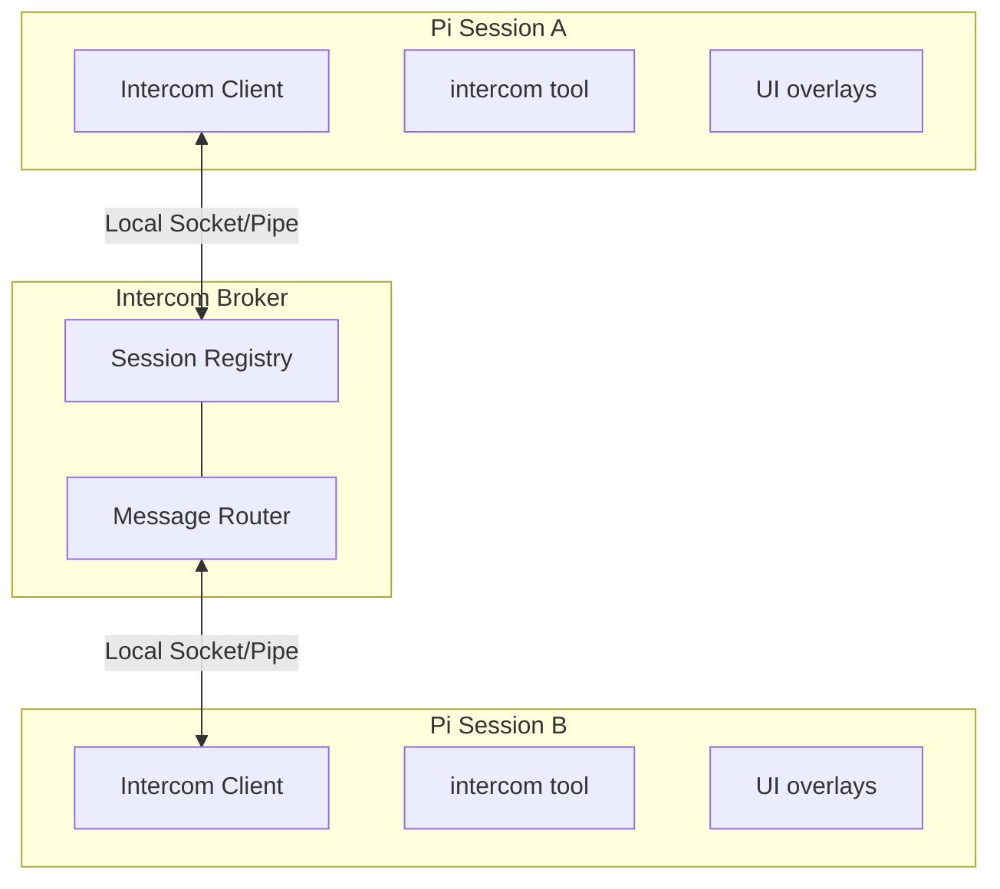

<p>
  
</p>

# Pi Intercom

Direct 1:1 messaging between pi sessions on the same machine. Send context, findings, or requests from one session to another — whether you're driving the conversation or letting agents coordinate.

```text
User flow: press Alt+M or run /intercom to pick a session and send a message
```

## Why

Sometimes you're running multiple pi sessions — one researching, one executing, one reviewing. Pi-intercom lets you:

- **User-driven orchestration** — Send context or findings from your research session to your execution session
- **Agent collaboration** — An agent can reach out to another session when it needs help or wants to share results
- **Session awareness** — See what other pi sessions are running and their current status

Unlike pi-messenger (a shared chat room for multi-agent swarms), pi-intercom is for targeted 1:1 communication where you pick the recipient.

Pi-intercom also integrates well with [pi-subagents](https://github.com/nicobailon/pi-subagents): delegated child agents get a child-only `contact_supervisor` tool when `pi-subagents` supplies bridge metadata. Use `reason: "need_decision"` for blocking clarification, `reason: "interview_request"` for multiple structured supervisor answers, and `reason: "progress_update"` for meaningful plan-changing updates. Normal sessions only see the regular `intercom` tool.

## In One Minute

Each pi session that has `pi-intercom` loaded and enabled connects to a tiny local broker over a local IPC transport. The broker keeps track of connected sessions and routes direct messages to the one you target by name or session ID. The extension gives you both a tool (`intercom`) and a small overlay UI (`/intercom` or `Alt+M`). Incoming messages wake idle recipients by default; active recipients see messages after the current tool call, when idle, or through explicit queue/steer delivery, and passive delivery is a discouraged opt-in for human-visible breadcrumbs only.

## Install

```bash
pi install . --local
```

Run that from this local fork checkout, then restart Pi in the project. The extension auto-connects to the broker on startup and registers the bundled `pi-intercom` skill for common coordination patterns.

## Development

```bash
npm run typecheck
npm run smoke:package
npm test
npm run smoke:real-pi
```

`typecheck` validates the extension against the current `@earendil-works` Pi runtime packages. `smoke:package` checks the local package shape without publishing. `smoke:real-pi` installs this checkout into an isolated temporary Pi home and verifies the package shows up in `pi list`. For live model-backed status/list checks, run:

```bash
PI_REAL_SMOKE_MODEL=openai/gpt-4o-mini npm run smoke:real-pi -- --llm
```

The `--llm` mode copies local `auth.json` and `models.json` into the isolated Pi agent dir. Set `PI_REAL_SMOKE_AUTH_AGENT_DIR` if your auth files are not in `~/.pi/agent`.

**Recommended:** Add this snippet to your project's `AGENTS.md` to help agents understand when to coordinate across sessions:

```xml
<pi-intercom>
Coordinate with other local pi sessions on related codebases. Use `/skill:pi-intercom` for patterns.

**When:** Same codebase (parallel work), reference codebase (consulting patterns), related repos (shared libraries).

**Not when:** Unrelated codebases, trivial questions, or when you can proceed independently.

**Principle:** Use `send` when no reply is needed, `ask` when blocked waiting for input, `delivery:"steer"` only for urgent course corrections, and passive delivery only for human-visible breadcrumbs the recipient model should not read now.
</pi-intercom>
```

A session becomes intercom-connected when all of these are true:
- the `pi-intercom` extension is installed and loaded in that session
- `enabled` is not set to `false` in `${PI_CODING_AGENT_DIR:-~/.pi/agent}/intercom/config.json`
- the session has started or reloaded after the extension was installed
- the local broker is running or can be auto-started

The session list only shows intercom-connected sessions, not every open Pi process on the machine.

If a session is unnamed, pi-intercom now exposes a runtime-only fallback alias like `subagent-chat-1a2b3c4d` so other sessions can still target it. That alias is not persisted as the Pi session title, so `pi --resume` can keep showing the transcript snippet instead of a generic `session-...` name.

## Quick Start

### From the Keyboard

Press **Alt+M** or type `/intercom` to open the session list overlay:

1. **Select a session** — Use arrow keys to pick a target session
2. **Compose message** — Write your message in the compose overlay. Pasted multiline handoffs are preserved.
3. **Choose mode** — Press Tab to toggle between Send and Request Reply mode. Request Reply marks the message as needing a reply and adds the recipient reply hint; the overlay itself does not wait for or collect that reply.
4. **Send** — Press Enter to send, Escape to cancel

### From the Agent

The agent can list sessions and send messages using the `intercom` tool. Tool calls and results render as compact transcript rows so send/ask/reply flows are easy to scan. For common patterns like planner-worker delegation, the bundled `pi-intercom` skill provides copy-paste ready examples:

```typescript
// List active sessions
intercom({ action: "list" })
// → **Current session:**
// → • executor (20d43841) — ~/projects/api (claude-sonnet-4) [self, idle, state:idle, accepts_asks:true, pending_asks:0, last_intercom_activity:none]
// →   ↳ self target unavailable; choose a peer from Other sessions; use pending/reply for inbound asks
// → **Other sessions:**
// → • research (6332faab) — ~/projects/api (claude-sonnet-4) [same cwd, thinking, state:busy, accepts_asks:false, pending_asks:1, last_intercom_activity:2m ago]
// →   ↳ send accepted; default ask returns peer_idle; use queue for normal follow-up, steer only to redirect; passive discouraged

// Ask a peer to start work and reply inline
intercom({ action: "ask", to: "research", message: "Check if UserService.validate() handles null. Reply with what you find." })
// → Reply from research: UserService.validate() handles null via the guard at line 42.

// Check connection status and the same live recipient guidance
intercom({ action: "status" })
// → Connected: Yes, Session ID: abc123, Active sessions: 3
// → Current session and other-session rows follow.

// Send with attachments (code snippets, files, or context)
intercom({
  action: "send",
  to: "worker",
  message: "Here's the fix:",
  attachments: [{
    type: "snippet",
    name: "auth.ts",
    language: "typescript",
    content: "function validate(user: User) { ... }"
  }]
})
```

### Receiving Messages

When a message arrives, it appears inline in your chat with the sender's info. Messages sent with `ask` include a reply hint:

```
**From research** (~/projects/api)

To reply, use the intercom tool: intercom({ action: "reply", message: "..." })

Found the issue — UserService.validate() doesn't check for null input.
See auth.ts:142-156.
```

The reply hint (enabled by default) points to `intercom({ action: "reply", ... })`, so recipients do not need raw sender or `replyTo` IDs. Idle recipients get a new turn immediately for `send` and `ask`; busy interactive recipients receive default messages once they go idle. Explicit `delivery:"queue"` uses Pi's native follow-up queue for stacked active-recipient messages; `queueMode:"replace"` stays intercom-staged for a short coalescing window and while active so older undelivered thread updates can be replaced. `delivery:"steer"` uses Pi's native steering queue. Attachment content is included in the agent-visible body, and messages are rendered inline and stored in Pi session history. Only `send` with passive delivery renders without waking the recipient model.

## Workflow: Planner-Worker Coordination

The most natural use of pi-intercom is splitting a task between two sessions — one holds the big picture, the other does the hands-on work. When the worker hits an ambiguity ("should I optimize for readability or performance here?"), they ask without losing context.

### Setup

Open two terminals and start pi in each. Name them so they can find each other:

```
# Terminal 1                    # Terminal 2
/name planner                   /name worker
```

Verify they see each other from either session:

```typescript
intercom({ action: "list" })
// → • worker — ~/projects/api (claude-sonnet-4) [idle]
```

### The Conversation

Here's how a typical exchange looks. The planner delegates with `ask` when it wants to wake an idle worker and receive an acknowledgement. The worker also uses `ask` for anything that needs a response — questions, discoveries, completion reports. `ask` sends the message and blocks until the recipient replies, so the sender gets the answer as a tool result and continues in the same turn.

**Planner delegates a task and wakes the worker:**
```typescript
intercom({
  action: "ask",
  to: "worker",
  message: "Task-3: Add retry logic to API client. Key files: src/api/client.ts, src/api/types.ts. Reply with ACK, then ask if anything's unclear."
})
// → Reply from worker: ACK — starting task-3.
```

**Worker hits an ambiguity — asks and waits:**
```typescript
intercom({
  action: "ask",
  to: "planner",
  message: "Should retry apply to all endpoints or just idempotent ones? Also, max retry count and backoff strategy?"
})
// → Reply from planner: Only GET/PUT/DELETE — never POST. Max 3 retries, exponential backoff starting at 100ms.
// Worker continues implementing with the answer, same turn, full context.
```

**Worker finds something unexpected — escalates and waits:**
```typescript
intercom({
  action: "ask",
  to: "planner",
  message: "Found: fetchWithTimeout swallows network errors. Fixing this changes the error shape. OK to proceed?"
})
// → Reply from planner: Yes, surface the error types. The current behavior is a bug.
```

**Worker reports completion:**
```typescript
intercom({
  action: "ask",
  to: "planner",
  message: "Task-3 done. Added RetryPolicy type, applied to GET/PUT/DELETE, surfaced NetworkError, 4 tests passing."
})
// → Reply from planner: Looks good. Move on to task-4.
```

### Communication Patterns

| Pattern | Action | Why |
|---------|--------|-----|
| **Task Delegation** | Planner uses `ask` | Wakes the worker and confirms it received the task. |
| **Clarification Request** | Worker uses `ask` | Worker needs the answer to proceed. Blocks until reply. |
| **Discovery Escalation** | Worker uses `ask` | Worker needs approval before changing course. |
| **Completion Report** | Worker uses `ask` | Planner might have follow-up instructions or the next task. |

### Reply Hints

When `replyHint` is enabled (the default), incoming asks include the exact `intercom()` call to respond:

```
**From planner** (~/projects/api)

To reply, use the intercom tool: intercom({ action: "reply", message: "..." })

Only GET/PUT/DELETE — never POST. Max 3 retries with exponential backoff starting at 100ms.
```

This matters because the agent receiving the message doesn't need to reconstruct raw `to` and `replyTo` IDs — the hint is right there. Combined with idle-gated `triggerTurn` delivery, it enables real back-and-forth conversation without interrupting work in progress. If the reply happens later instead of in the triggered turn, `intercom({ action: "reply" })` falls back to the single unresolved inbound ask, and `intercom({ action: "pending" })` shows who is still waiting.

### `send` vs `ask`

`send` is non-blocking — the tool returns after the broker either delivers to a live recipient or reports that replace-mode delivery is queued, and it does not return any later response. It wakes idle recipients by default; active recipients may see the message after the current tool call or when idle. Use `ask` with `delivery:"steer"` or `delivery:"queue"` for active-recipient coordination that needs a reply in the same workflow. `send` supports `delivery:"queue"` for active-recipient follow-up, `delivery:"steer"` for urgent one-way course correction, and passive delivery for human-visible breadcrumbs only; avoid passive delivery for agent-to-agent coordination. If you want an approval dialog before non-reply sends, set `confirmSend: true` in config. Replies that include `replyTo` still skip confirmation so reply-hint flows can continue without an extra approval step.

`ask` sends the message and waits up to `askTimeoutMs` (default 2 minutes). If the peer publishes `accepts_asks:false`, a default ask is still delivered but the tool returns promptly with `delivered:true`, `replied:false`, and `reason:"peer_idle"` instead of burning the full timeout. Explicit `delivery:"queue"` or `delivery:"steer"` asks keep waiting for a reply because the caller deliberately chose an active-recipient path. The peer can reply later as a normal intercom message.

`reply` is receiver-side sugar for replying to an inbound ask. In the turn triggered by an incoming intercom ask, `intercom({ action: "reply", message: "..." })` targets that exact sender and message automatically. If you reply later, it falls back to the single unresolved inbound ask. If multiple asks are pending, use `intercom({ action: "pending" })` to inspect them and then call `reply` with `to` to disambiguate.

The planner typically uses `send` for new context or progress and `ask` for anything requiring a decision or acknowledgement. Use `delivery:"queue"` when an active peer should handle the note after current work, `delivery:"steer"` only when the current path likely needs correction, and passive delivery only when the note is for the human transcript. If you prefer manual approval for outgoing non-reply messages, turn on `confirmSend: true`.

## Workflow: Subagent-to-Supervisor Escalation

This workflow requires [`pi-subagents`](https://github.com/nicobailon/pi-subagents) to be installed and to supply child bridge metadata. When `pi-subagents` spawns a delegated child with that metadata, the child session gets a subagent-only `contact_supervisor` tool in addition to the regular `intercom` tool. Normal sessions never see `contact_supervisor`.

### When the Tool Appears

`contact_supervisor` only registers when `pi-subagents` sets all of these environment variables:

- `PI_SUBAGENT_ORCHESTRATOR_TARGET` — the supervisor session name or ID
- `PI_SUBAGENT_RUN_ID` — the run identifier
- `PI_SUBAGENT_CHILD_AGENT` — the agent type
- `PI_SUBAGENT_CHILD_INDEX` — the child index within the run

If any are missing, the session falls back to the regular `intercom` tool. A subagent status line may mention an intercom target before the child is actually registered with pi-intercom; treat `intercom({ action: "list" })` as the source of truth. If the advertised target is absent from `list`, use `contact_supervisor` from the child side or normal subagent controls instead of sending to that target.

When both extensions are enabled, parent sessions can use `subagent({ action: "nudge", id: "<run-id>", message: "..." })` to send a non-blocking steered nudge to a live child. `subagent status` may also show the direct blocking `intercom({ action: "ask", to: "...", delivery: "steer", message: "..." })` path. `pi-intercom` remains the source of truth for connected sessions and only delivers to registered local peers.

### Three Reasons

| Reason | Behavior | Use When |
|--------|----------|----------|
| `need_decision` | Sends an ask and blocks until the supervisor replies (`askTimeoutMs`, default 2 minutes) | The subagent is blocked, uncertain, needs approval, or faces a product/API/scope decision |
| `interview_request` | Sends structured questions and blocks until the supervisor replies | The subagent needs multiple machine-readable answers from the supervisor in one exchange |
| `progress_update` | Non-blocking update to the supervisor | Meaningful progress or unexpected discoveries that change the plan |

Do not use `contact_supervisor` for routine completion handoffs. Return the final subagent result normally through `pi-subagents`.

Intercom delivery is for live coordination and grouped completion notices. Durable subagent output still lives in `pi-subagents` result details and artifact/output paths (`savedOutputPath`, `artifactPaths`, or explicit workspace `output` files). If a grouped intercom notice says output was delivered, use it as a notification; use the artifact or explicit output path as the source of truth for long reports.

### Example: Blocked Subagent Asks for Guidance

```typescript
contact_supervisor({
  reason: "need_decision",
  message: "The auth service returns 403 instead of 401 for expired tokens. Should I treat 403 as a re-auth trigger or a hard failure?"
})
// → Reply from supervisor: Treat 403 as re-auth trigger. Update the token refresh logic.
```

### Example: Structured Supervisor Interview

```typescript
contact_supervisor({
  reason: "interview_request",
  message: "Please answer these before I continue the migration.",
  interview: {
    title: "API migration choices",
    questions: [
      { id: "api", type: "single", question: "Which API should I target?", options: ["Stable API", "Experimental API"] },
      { id: "constraints", type: "text", question: "What constraints should I preserve?" }
    ]
  }
})
// → Reply from supervisor: { "responses": [{ "id": "api", "value": "Stable API" }, ...] }
```

### Example: Progress Update

```typescript
contact_supervisor({
  reason: "progress_update",
  message: "Discovered the bug is in the retry wrapper, not the API client. Fixing the wrapper will also close issue #42."
})
// → Progress update sent to supervisor planner
```

### What the Supervisor Sees

The supervisor receives a formatted message with run metadata:

```
**From subagent-worker-78f659a3-1**

Subagent needs a supervisor decision.
Run: 78f659a3
Agent: worker
Child index: 0

Which API should I use?
```

Reply hints work the same as regular `intercom` ask/reply flows. The supervisor can reply with `intercom({ action: "reply", message: "..." })` and the subagent receives the answer as the tool result. If the parent agent is busy and later needs to recover the request, `intercom({ action: "pending" })` summarizes supervisor asks with run id, agent, child target, and question text.

For `interview_request`, the supervisor message includes the structured questions plus a fenced JSON answer example using this stable shape:

```json
{
  "responses": [
    { "id": "api", "value": "Stable API" },
    { "id": "constraints", "value": "Keep the public error shape unchanged." }
  ]
}
```

The supervisor can reply with plain JSON or a fenced `json` block. If the reply matches the `{ "responses": [...] }` shape and references valid question ids/options, the child tool result includes it in `details.structuredReply` while still showing the raw reply text.

## Tool Reference

### intercom

| Parameter | Type | Description |
|-----------|------|-------------|
| `action` | string | `"list"`, `"send"`, `"ask"`, `"reply"`, `"pending"`, or `"status"` |
| `to` | string | Target session name or ID (for send/ask, or to disambiguate reply) |
| `message` | string | Message text (for send/ask/reply) |
| `attachments` | array | Optional `file`, `snippet`, or `context` attachments |
| `replyTo` | string | Optional message ID for threading or replying to an `ask` |
| `delivery` | string | Optional: `"queue"` waits behind active work, `"steer"` injects after the current tool call, `"passive"` does not wake the recipient model (`send` only). |
| `queueMode` | string | Optional with queued delivery: `"stack"` keeps all messages, `"replace"` keeps only the latest undelivered message for the same `threadId` after a short coalescing window. |
| `threadId` | string | Required for `queueMode:"replace"`; stable topic key for replacement. |
| `passive` | boolean | Legacy `send`-only alias for `delivery:"passive"`. Discouraged for agent-to-agent messages. |

### contact_supervisor

Only registered in sessions where `pi-subagents` supplied the required child bridge metadata. Contacts the supervisor session that delegated the current task.

| Parameter | Type | Description |
|-----------|------|-------------|
| `reason` | string | `"need_decision"` (blocking), `"interview_request"` (blocking structured questions), or `"progress_update"` (non-blocking) |
| `message` | string | The decision request, optional interview note, or progress update |
| `interview` | object | Required for `interview_request`: `{ title?, description?, questions: [...] }` |

**`need_decision`** — Sends a formatted ask to the supervisor and blocks until it replies (`askTimeoutMs`, default 2 minutes). The reply comes back as the tool result. Includes run metadata in the message so the supervisor knows which subagent is asking.

**`interview_request`** — Sends a formatted, agent-readable interview to the supervisor and blocks until it replies. Questions use a local pi-interview-like shape: `{ id, type, question, options?, context? }` where `type` is `single`, `multi`, `text`, `image`, or `info`. `info` questions are context-only and do not need responses. The supervisor reply should be JSON with `{ "responses": [{ "id": "...", "value": ... }] }`. Parsed JSON replies are returned in `details.structuredReply`.

**`progress_update`** — Sends a non-blocking update to the supervisor. Returns immediately after delivery. Use only for meaningful progress or unexpected discoveries that change the plan.

### intercom actions

**`list`** — Returns the current session plus other active intercom-connected sessions with name, safe target, working directory, model, live status, and peer health tags: `state` (`idle`, `busy`, or `unknown`), `accepts_asks`, `pending_asks`, `last_intercom_activity`, and `last_seen`. Peer rows include live delivery guidance for `ask`, `send`, `queue`, `steer`, and the discouraged passive path; the self row says self-target delivery is unavailable and points to peer targets / `pending` / `reply`. Status is derived automatically from Pi lifecycle events: `idle`, `thinking`, or `tool:<name>`. If multiple sessions have the same name, use the displayed target exactly as shown, for example `to: "ca7bfec2"`. The target may be longer than eight characters when needed to avoid collisions.

**`send`** — Sends a non-blocking message to the specified session. It wakes idle recipients by default and returns broker acceptance, not a later response. Omit `delivery` for the default safe path: active interactive recipients are idle-gated before wake. Use `delivery:"queue"` to hand the message to Pi's native follow-up queue, `delivery:"steer"` only to course-correct active work, and `delivery:"passive"`/`passive:true` only for human-visible breadcrumbs. `queueMode:"replace"` with a `threadId` replaces older undelivered intercom-staged messages for that thread after a short coalescing window; once a message is handed to Pi's native queue it cannot be keyed-replaced. Set `confirmSend: true` in config if you want a confirmation dialog for non-reply sends. Replies that include `replyTo` skip confirmation.

**`ask`** — Sends a message and waits for the recipient to reply (`askTimeoutMs`, default 2 minutes). The reply is returned as the tool result. If the target publishes `accepts_asks:false`, a default ask is delivered and returns promptly with `replied:false` and `reason:"peer_idle"`; explicit `delivery:"queue"` or `delivery:"steer"` asks still wait for a reply. No confirmation dialog. Only one pending waiting `ask` is allowed per session at a time. Use this when the agent needs the answer to continue working. Passive delivery is rejected.

**`reply`** — Replies to the current intercom-triggered message if there is one. Otherwise it falls back to the single unresolved inbound ask. If multiple asks are pending, pass `to` or inspect them with `pending` first. Under the hood this is still a normal `send` with the exact `replyTo` value.

**`pending`** — Lists unresolved inbound asks with sender, message ID, elapsed time, and a short preview. For `pi-subagents` supervisor asks, the preview expands the run id, agent, child intercom target, and question so the parent can reply without guessing. Useful when replying after the original triggered turn.

**`status`** — Shows connection status, session ID, total active sessions, and the same live recipient capability rows as `list` so agents can choose `ask`, `queue`, `steer`, or avoid passive delivery without a second call.

## Keyboard Shortcuts

| Key | Action |
|-----|--------|
| Alt+M | Open session list overlay |
| ↑/↓ | Navigate session list |
| Tab | Toggle Send / Request Reply mode in the compose overlay |
| Enter | Select session / Send or ask |
| Escape | Cancel / Close overlay |

## Config

Create `${PI_CODING_AGENT_DIR:-~/.pi/agent}/intercom/config.json`:

```json
{
  "brokerCommand": "npx",
  "brokerArgs": ["--no-install", "tsx"],
  "confirmSend": false,
  "enabled": true,
  "replyHint": true,
  "askTimeoutMs": 120000,
  "sendTimeoutMs": 8000,
  "listTimeoutMs": 5000,
  "status": "researching"
}
```

| Setting | Default | Description |
|---------|---------|-------------|
| `brokerCommand` | `"npx"` | Command used to start the local broker process when you override the default |
| `brokerArgs` | `["--no-install", "tsx"]` | Arguments passed to `brokerCommand` before the broker script path. The built-in default launches the package-local `tsx` CLI through the current Node executable to avoid shell/shim issues. |
| `confirmSend` | false | Show a confirmation dialog before non-reply sends from an interactive session with UI |
| `enabled` | true | Enable/disable intercom entirely |
| `replyHint` | true | Include reply instructions in incoming asks |
| `askTimeoutMs` | `120000` | Reply wait timeout for `ask` and blocking supervisor requests |
| `sendTimeoutMs` | `8000` | Broker delivery-ack timeout for sends/asks |
| `listTimeoutMs` | `5000` | Session-list response timeout |
| `status` | — | Optional custom status suffix shown after the automatic lifecycle status, for example `thinking · researching` |

For example, if you have Bun installed and want it to start the broker directly, use:

```json
{
  "brokerCommand": "bun",
  "brokerArgs": []
}
```

Pi-intercom publishes live session status automatically. Sessions register as `idle`, switch to `thinking` while the agent is running, show `tool:<name>` during tool execution, and return to `idle` on agent completion. If `status` is set in config, it is appended as context instead of replacing the lifecycle status.

## How It Works



The broker is a standalone TypeScript process that manages session registration and message routing. It auto-spawns when the first intercom-enabled session needs it and exits after 5 seconds when the last connected session disconnects. Clients now reconnect automatically if the broker disappears and later comes back.

Messages use length-prefixed JSON over a local socket/pipe transport (4-byte length + JSON payload) to handle fragmentation properly. The protocol includes request correlation for session listing, explicit delivery failures, and validation for malformed or out-of-order messages.

Async extension work (startup, inbound flushes, reconnects, overlays, and relays) no-ops if the session shuts down or reloads before it settles.

Runtime files:
- Unix domain socket — short temp path named `pi-intercom-<hash>.sock` on macOS/Linux, keyed by `PI_CODING_AGENT_DIR` or `~/.pi/agent`; Windows uses a named pipe instead
- `${PI_CODING_AGENT_DIR:-~/.pi/agent}/intercom/broker-launch.vbs` — Windows helper script used to launch the broker without a console window
- `${PI_CODING_AGENT_DIR:-~/.pi/agent}/intercom/broker.pid` — Broker process ID
- `${PI_CODING_AGENT_DIR:-~/.pi/agent}/intercom/config.json` — User configuration

## Design Decisions

**Local IPC instead of TCP.** Same-machine only by design. `pi-intercom` uses Unix sockets on macOS/Linux and a named pipe on Windows, which keeps setup simple and avoids port management.

**Auto-spawn with file lock.** The broker starts on first connection and exits after 5 seconds idle. There is no daemon to manage. A spawn lock file, keyed by PID and timestamp, prevents duplicate brokers when multiple sessions start at once.

**`ask` stays client-side.** The broker still routes plain messages; it does not have a special request/response mode for `ask`. The sender marks the message as expecting a reply, the recipient wakes or queues according to the delivery mode, and the sender waits for the matching reply before returning it as the tool result. Reply hints make that flow practical by showing the recipient the exact `reply` call to use. Separately, `list` / `sessions` now carry a `requestId` so a delayed session-list reply cannot be mistaken for a newer one.

## pi-intercom vs pi-messenger

| Aspect | pi-intercom | pi-messenger |
|--------|-------------|--------------|
| **Model** | Direct 1:1 messaging | Shared chat room |
| **Primary use** | User orchestrating sessions | Autonomous agent coordination |
| **Discovery** | Broker-based (real-time) | File-based registry |
| **Messages** | Private, session-to-session | Broadcast to all agents |
| **Persistence** | In Pi session history | Shared coordination files |

Use pi-messenger for multi-agent swarms working on a shared task. Use pi-intercom when you want to manually coordinate your own sessions or have one agent reach out to another specific session.

## File Structure

```
~/.pi/agent/extensions/pi-intercom/
├── package.json
├── index.ts              # Extension entry point
├── types.ts              # SessionInfo, Message, protocol types
├── config.ts             # Config loading
├── broker/
│   ├── broker.ts         # Broker process
│   ├── client.ts         # IntercomClient class
│   ├── framing.ts        # Length-prefixed JSON protocol
│   ├── paths.ts          # Platform-specific socket/pipe paths
│   ├── spawn.ts          # Auto-spawn logic with lock file
│   ├── spawn.test.ts     # Broker spawn tests
│   └── paths.test.ts     # Path resolution tests
├── ui/
│   ├── session-list.ts   # Session selection overlay
│   ├── compose.ts        # Message composition overlay
│   └── inline-message.ts # Received message display
└── skills/
    └── pi-intercom/
        └── SKILL.md      # Bundled skill for common patterns
```

## Limitations

- **Same machine only** — Uses local sockets/pipes, no network support
- **No dedicated intercom log** — Messages are kept in Pi session history, but there is no separate intercom transcript or inbox
- **No attachments UI** — `file`, `snippet`, and `context` attachments are supported in the protocol, but not in the compose overlay
- **Only connected sessions appear** — The list shows Pi sessions that have loaded `pi-intercom` and successfully registered with the broker, not every open Pi process on the machine
- **Broker lifecycle** — The broker auto-spawns on first use and exits when idle; sessions reconnect automatically if the broker restarts
